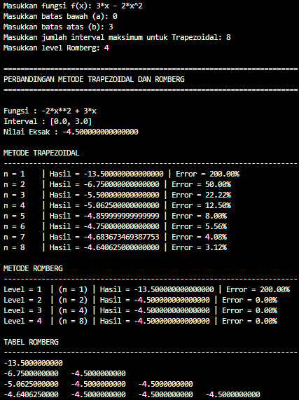

<div align=center>
    
# Praktikum 2 - Metode Integrasi Romberg
## Kelompok 10

|     NRP    |         Nama        |
|:----------:|:-------------------:|
| 5025251022 | Ahmad Radho Alfariz |
| 5025251047 | Akhmad Fahmi        |
| 5025251059 | Arsya Argananta     |

</div>

## Pertanyaan
Salah satu kelemahan dari metode Trapezoidal adalah kita harus menggunakan jumlah interval yang besar untuk memperoleh akurasi yang diharapkan. Buatlah sebuah program komputer untuk menjelaskan bagaimana metode Integrasi Romberg dapat mengatasi kelemahan tersebut.

## Langkah-langkah & Potongan Kode
#### 1. Meng-_import library_ yang diperlukan untuk kebutuhan perhitungan numerik.
```python
from sympy import symbols, sympify, lambdify, integrate, N
import numpy as np
```

#### 2. _Input_ data dan mengonversi _input string_ fungsi agar bisa dibaca oleh python.
```python
x = symbols('x')

fungsi_str = input("Masukkan fungsi f(x): ")
expr = sympify(fungsi_str)

a = float(N(sympify(input("Masukkan batas bawah (a): "))))
b = float(N(sympify(input("Masukkan batas atas (b): "))))

n_maks = int(input("Masukkan jumlah interval maksimum untuk Trapezoidal: "))
level = int(input("Masukkan level Romberg: "))

f = lambdify(x, expr, "numpy")
```

#### 3. Mencari nilai eksak.
```python
try:
    nilai_eksak = float(N(integrate(expr, (x, a, b))))
except:
    nilai_eksak = None
```

#### 4. Menghitung menggunakan metode Trapezoidal.
```python
def trapezoidal(f, a, b, n):
    h = (b - a) / n

    jumlah = f(a) + f(b)

    for i in range(1, n):
        jumlah += 2 * f(a + i * h)

    return (h / 2) * jumlah
```

#### 5. Menghitung menggunakan metode Romberg.
```python
def romberg(f, a, b, level):
    R = [[0.0 for _ in range(level)] for _ in range(level)]

    for i in range(level):
        n = 2 ** i
        R[i][0] = trapezoidal(f, a, b, n)

    for j in range(1, level):
        for i in range(j, level):
            R[i][j] = (
                R[i][j - 1]
                + (R[i][j - 1] - R[i - 1][j - 1])
                / (4 ** j - 1)
            )

    return R
```

#### 6. Menampilkan _output_ (ekspresi fungsi, interval, dan nilai eksak).
```python
print("\n" + "=" * 70)
print("PERBANDINGAN METODE TRAPEZOIDAL DAN ROMBERG")
print("=" * 70)

print(f"\nFungsi : {expr}")
print(f"Interval : [{a}, {b}]")

if nilai_eksak is not None:
    print(f"Nilai Eksak : {nilai_eksak:.15f}")
else:
    print("Nilai Eksak : Tidak dapat dihitung secara simbolik")
```

#### 7. Menampilakan hasil perhitungan metode Trapezoidal.
```python
print("\nMETODE TRAPEZOIDAL")
print("-" * 70)

for n in range(1, n_maks + 1):
    hasil = trapezoidal(f, a, b, n)

    if nilai_eksak is not None:
        if nilai_eksak != 0:
            error = abs((nilai_eksak - hasil) / nilai_eksak) * 100
        else:
            error = abs(nilai_eksak - hasil)

        print(
            f"n = {n:<4} | "
            f"Hasil = {hasil:.15f} | "
            f"Error = {error:.2f}%"
        )
    else:
        print(
            f"n = {n} | "
            f"Hasil = {hasil:.15f}"
        )
```

#### 8. Menampilkan hasil perhitungan metode Romberg.
```python
print("\nMETODE ROMBERG")
print("-" * 70)

R = romberg(f, a, b, level)

for i in range(level):
    hasil = R[i][i]
    n = 2 ** i

    if nilai_eksak is not None:
        if nilai_eksak != 0:
            error = abs((abs(nilai_eksak - hasil)) / nilai_eksak) * 100
        else:
            error = abs(nilai_eksak - hasil)

        print(
            f"Level = {i+1:<2} | "
            f"(n = {n}) | "
            f"Hasil = {hasil:.15f} | "
            f"Error = {error:.2f}%"
        )
    else:
        print(
            f"Level = {i+1:<2} "
            f"(n = {n}) | "
            f"Hasil = {hasil:.15f}"
        )
```

#### 9. Menampilkan tabel metode Romberg.
```python
print("\nTABEL ROMBERG")
print("-" * 70)

for i in range(level):
    for j in range(i + 1):
        print(f"{R[i][j]:.10f}", end="\t")
    print()
```

## Kode Penuh (_Full Code_)
```python
from sympy import symbols, sympify, lambdify, integrate, N
import numpy as np

x = symbols('x')

fungsi_str = input("Masukkan fungsi f(x): ")
expr = sympify(fungsi_str)

a = float(N(sympify(input("Masukkan batas bawah (a): "))))
b = float(N(sympify(input("Masukkan batas atas (b): "))))

n_maks = int(input("Masukkan jumlah interval maksimum untuk Trapezoidal: "))
level = int(input("Masukkan level Romberg: "))

f = lambdify(x, expr, "numpy")

try:
    nilai_eksak = float(N(integrate(expr, (x, a, b))))
except:
    nilai_eksak = None

def trapezoidal(f, a, b, n):
    h = (b - a) / n

    jumlah = f(a) + f(b)

    for i in range(1, n):
        jumlah += 2 * f(a + i * h)

    return (h / 2) * jumlah

def romberg(f, a, b, level):
    R = [[0.0 for _ in range(level)] for _ in range(level)]

    for i in range(level):
        n = 2 ** i
        R[i][0] = trapezoidal(f, a, b, n)

    for j in range(1, level):
        for i in range(j, level):
            R[i][j] = (
                R[i][j - 1]
                + (R[i][j - 1] - R[i - 1][j - 1])
                / (4 ** j - 1)
            )

    return R

print("\n" + "=" * 70)
print("PERBANDINGAN METODE TRAPEZOIDAL DAN ROMBERG")
print("=" * 70)

print(f"\nFungsi : {expr}")
print(f"Interval : [{a}, {b}]")

if nilai_eksak is not None:
    print(f"Nilai Eksak : {nilai_eksak:.15f}")
else:
    print("Nilai Eksak : Tidak dapat dihitung secara simbolik")

print("\nMETODE TRAPEZOIDAL")
print("-" * 70)

for n in range(1, n_maks + 1):
    hasil = trapezoidal(f, a, b, n)

    if nilai_eksak is not None:
        if nilai_eksak != 0:
            error = abs((nilai_eksak - hasil) / nilai_eksak) * 100
        else:
            error = abs(nilai_eksak - hasil)

        print(
            f"n = {n:<4} | "
            f"Hasil = {hasil:.15f} | "
            f"Error = {error:.2f}%"
        )
    else:
        print(
            f"n = {n:4} | "
            f"Hasil = {hasil:.15f}"
        )

print("\nMETODE ROMBERG")
print("-" * 70)

R = romberg(f, a, b, level)

for i in range(level):
    hasil = R[i][i]
    n = 2 ** i

    if nilai_eksak is not None:
        if nilai_eksak != 0:
            error = abs((abs(nilai_eksak - hasil)) / nilai_eksak) * 100
        else:
            error = abs(nilai_eksak - hasil)

        print(
            f"Level = {i+1:<2} | "
            f"(n = {n}) | "
            f"Hasil = {hasil:.15f} | "
            f"Error = {error:.2f}%"
        )
    else:
        print(
            f"Level = {i+1:<2} "
            f"(n = {n}) | "
            f"Hasil = {hasil:.15f}"
        )

print("\nTABEL ROMBERG")
print("-" * 70)

for i in range(level):
    for j in range(i + 1):
        print(f"{R[i][j]:.10f}", end="\t")
    print()
```

## _Screenshot_


## Kesimpulan
Berdasarkan program komputer yang telah dibuat, dapat disimpulkan bahwa metode Romberg mampu mengatasi kelemahan metode Trapezoidal yang memerlukan jumlah interval yang besar untuk memperoleh akurasi yang tinggi. Metode Romberg tidak menghilangkan kebutuhan untuk memperkecil interval, tetapi memanfaatkan hasil perhitungan Trapezoidal pada beberapa ukuran interval yang berbeda. Selanjutnya, metode Romberg menerapkan teknik ekstrapolasi Richardson untuk mengurangi error dengan lebih cepat sehingga hasil perhitungan memiliki tingkat konvergensi menuju nilai eksak yang lebih cepat pula. Oleh karena itu, metode Romberg umumnya mampu menghasilkan akurasi yang lebih baik dibandingkan metode Trapezoidal dengan jumlah interval yang relatif lebih sedikit.
